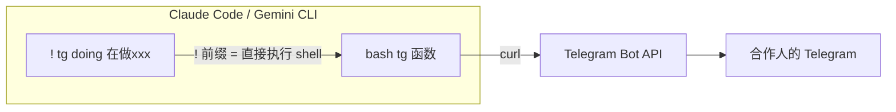
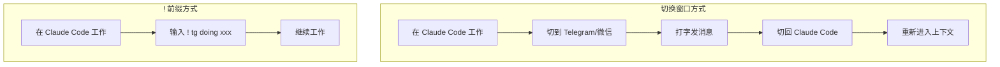

# 在 Coding Agent 内直接沟通 — 零 Token 方案

## 核心思路



`!` 前缀让命令绕过 AI 直接执行，不消耗任何 token。

## 前置配置（一次性）

在 `~/.bashrc` 或 `~/.zshrc` 末尾添加：

```bash
tg() {
  local TOPICS="doing=3 block=4 handoff=3 decision=6 review=5"
  local tid=$(echo "$TOPICS" | grep -o "$1=[0-9]*" | cut -d= -f2)
  [ -z "$tid" ] && echo "kind: doing | block | handoff | decision | review" && return 1
  local kind="$1"; shift
  curl -s -X POST "https://api.telegram.org/bot<BOT_TOKEN>/sendMessage" \
    -d chat_id=<CHAT_ID> \
    -d message_thread_id="$tid" \
    -d "text=[$kind] $*" > /dev/null && echo "✓ sent"
}
```

替换 `<BOT_TOKEN>` 和 `<CHAT_ID>`，然后 `source ~/.bashrc`。

## 在 Claude Code 里使用

不用退出 Claude Code，直接在输入框输入：

```
> ! tg doing 开始做 Issue #34
✓ sent

> ! tg block Groq 限流了，等 10 分钟
✓ sent

> ! tg handoff PR #30 写完了，你来 review
✓ sent

> ! tg decision session schema 用 jsonb 存 beat_trace
✓ sent

> ! tg review PR #30 重点看 agent.py L319
✓ sent
```

然后继续跟 Claude 对话，不中断工作流。

## 在 Gemini CLI 里使用

完全一样：

```
> ! tg doing 在改前端组件
✓ sent
```

## 在 Codex / 其他 Agent 里使用

任何支持 shell 执行的 agent 都可以：

```bash
# 如果 agent 支持 ! 前缀
! tg doing xxx

# 如果 agent 支持 shell tool
tg doing xxx
```

## 工作流示例

```
你正在用 Claude Code 改代码...

> 帮我修复 agent.py 的路径问题        ← 正常跟 AI 对话（消耗 token）
(Claude 改完代码)

> ! tg doing agent.py 路径修复完成     ← 通知合作人（零 token）

> 现在跑一下 Day 1 walkthrough        ← 继续跟 AI 对话
(Claude 跑测试)

> ! tg handoff Day 1-7 验证通过，PR #30 你来 review  ← 零 token

> 接下来做 Issue #34                   ← 继续工作
```

## 对比



| | 切换窗口 | ! 前缀 |
|---|---|---|
| 中断工作流 | 是 | 否 |
| Token 消耗 | 0 | 0 |
| 需要鼠标 | 是 | 否 |
| 上下文丢失 | 可能 | 不可能 |
