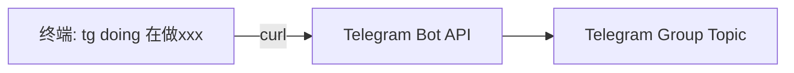
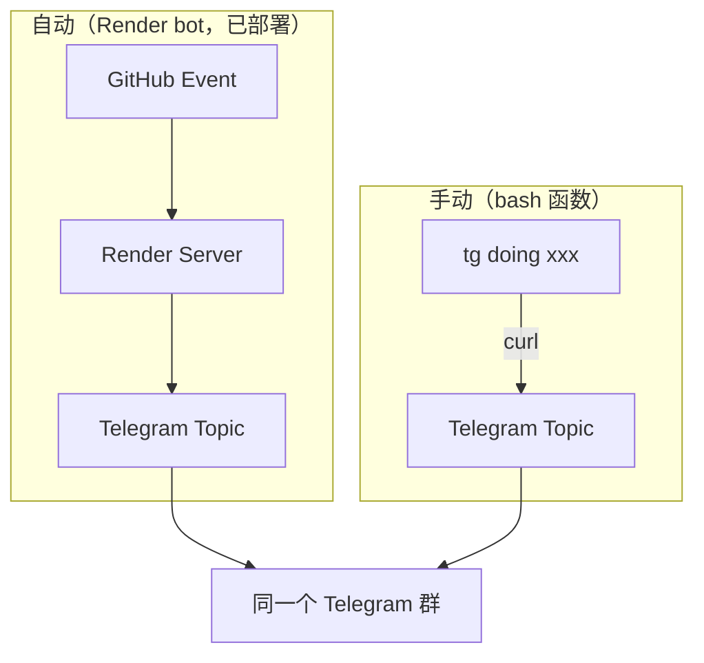

# Team Sync — Shell 快捷通知

零依赖、零 token 的终端到 Telegram 通知方案。

## 原理



不经过任何 AI agent / Python / 服务器。一个 bash 函数 + 一个 curl 调用。

## 安装

把以下内容加到 `~/.bashrc`（Linux）或 `~/.zshrc`（macOS）末尾：

```bash
# --- Team Sync to Telegram ---
tg() {
  local TOPICS="doing=3 block=4 handoff=3 decision=6 review=5"
  local tid=$(echo "$TOPICS" | grep -o "$1=[0-9]*" | cut -d= -f2)
  [ -z "$tid" ] && echo "Usage: tg <kind> <message>" && echo "kind: doing | block | handoff | decision | review" && return 1
  local kind="$1"; shift
  curl -s -X POST "https://api.telegram.org/bot<BOT_TOKEN>/sendMessage" \
    -d chat_id=<CHAT_ID> \
    -d message_thread_id="$tid" \
    -d "text=[$kind] $*" > /dev/null && echo "✓ sent to $kind"
}
```

替换 `<BOT_TOKEN>` 和 `<CHAT_ID>` 为实际值，然后：

```bash
source ~/.bashrc
```

## 使用

```bash
tg doing 开始做 Issue #34 session schema
tg block Groq API 限流，等恢复
tg handoff PR #30 写完了，交给你 review
tg decision Director 判定保持 Groq 不换 OpenAI
tg review PR #30 重点看 agent.py L319
```

## Topic 映射

| kind | Telegram Topic | 含义 |
|------|---------------|------|
| doing | 10-Doing | 正在做什么 |
| block | 20-Blockers | 被什么卡住 |
| handoff | 10-Doing | 交接给对方 |
| decision | 40-Decisions | 架构决策 |
| review | 30-PR-Review | PR 要重点看什么 |

## 多人协作

每个人在自己机器上加同样的 `tg` 函数即可。消息通过 `[kind]` 前缀区分类型，通过 Telegram 用户名区分发送者（因为 Bot 发送时 Telegram 不显示发送者名字，建议在消息里加名字缩写）：

```bash
tg doing "[J] 开始做 session schema"
tg doing "[H] 在改前端 report 页面"
```

## 新项目适配

只需要改 3 个值：

1. `BOT_TOKEN` — 新项目的 bot（或复用已有 bot）
2. `CHAT_ID` — 新项目的 Telegram 群 ID
3. `TOPICS` — 新群的 topic thread ID 映射

可以定义多个函数区分项目：

```bash
tg() { _tg_send "-100xxx" "3 4 3 6 5" "$@"; }       # 项目 A
tg2() { _tg_send "-100yyy" "2 3 2 5 4" "$@"; }      # 项目 B

_tg_send() {
  local chat="$1"; shift
  local ids=($1); shift
  local kinds=(doing block handoff decision review)
  local kind="$1"; shift
  for i in "${!kinds[@]}"; do
    [ "${kinds[$i]}" = "$kind" ] && tid="${ids[$i]}" && break
  done
  [ -z "$tid" ] && echo "kind: doing|block|handoff|decision|review" && return 1
  curl -s -X POST "https://api.telegram.org/bot<BOT_TOKEN>/sendMessage" \
    -d chat_id="$chat" -d message_thread_id="$tid" -d "text=[$kind] $*" > /dev/null && echo "✓"
}
```

## 与 GitHub 自动通知的关系



- GitHub 自动通知（issue/PR/blocker）走 Render bot，不需要你操作
- 人工状态同步走 `tg` 命令，不消耗 token
- 两者发到同一个群的不同 topic，不冲突
